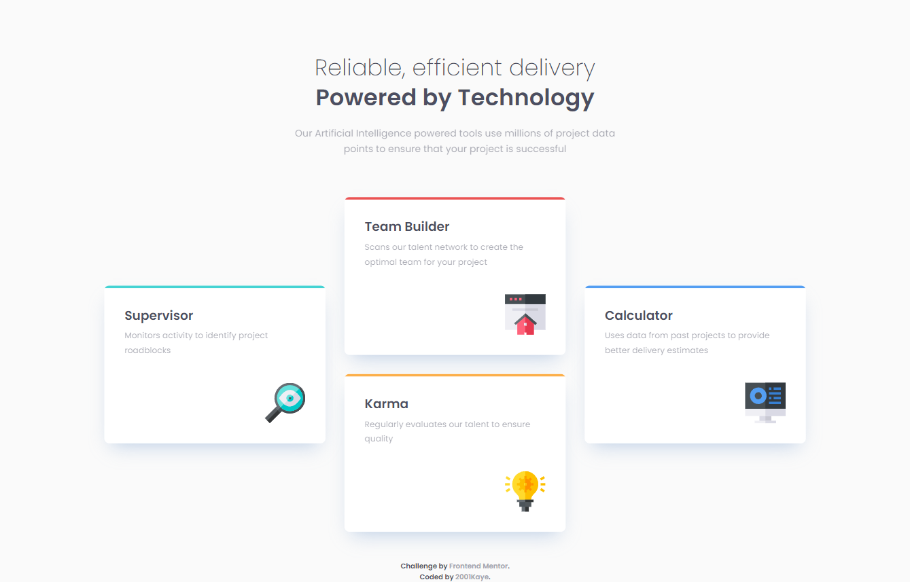

# Frontend Mentor - Four card feature section solution

This is a solution to the [Four card feature section challenge on Frontend Mentor](https://www.frontendmentor.io/challenges/four-card-feature-section-weK1eFYK). Frontend Mentor challenges help you improve your coding skills by building realistic projects. 

## Table of contents

- [Overview](#overview)
  - [The challenge](#the-challenge)
  - [Screenshot](#screenshot)
  - [Links](#links)
- [My process](#my-process)
- [Author](#author)

## Overview

### The challenge

Users should be able to:

- View the optimal layout for the site depending on their device's screen size

### Screenshot

### Links

- Solution URL: [solution](https://www.frontendmentor.io/solutions/four-card-feature-section-using-gird-D2FBfnbgZ)
- Live Site URL: [live site](https://jhan117.github.io/Four-card-feature-section/)

## My process

시작 - 2022.02.27
   
[구성]
1. content
2. 4 card
   
[계획]   
flex나 grid를 이용해서 card 1 + (card 2~3) + card 4 이렇게 구성하면 될 것 같은데... 복잡한 위치가 아니라서... 대충 flex wrap 기능 쓸까...?   
는... 둘이 div로 따로 빼놓기가 뭐해서 고민하다가 grid로 하기로 함   
   
카드 넓이가 넓어지는 것보다는 배경만 넓어지다가 breakpoint에서 배열이 되는 그런게 더 이쁠듯. 넓어지면 별로 안 이쁘던데 아 물론 desktop 넓이랑 다르니 desktop에서의 카드 넓이를 max-width로 주고 하면 될 듯.

---

완성 - 2022.02.27   
~~너무 이쁜데...? ㅋㅋㅋㅎㅎ~~   
카드 위에 테두리 어떻게 할지 조금 애먹었다. 내가 찾은 방법은 두 가지인데 하나는 after로 직사각형 모양의 background color를 만든 후 위치를 조정하는 것. 두 번째는 border-top을 이용해서 주던데... 원하는 느낌이 아니였고 밑이 같이 border-radius가 먹어서 이상한 모양이 되었다. 해결하기에는 after를 잘 안 쓰기도 해서 잘 이용해보자 싶어서 after로 해봤다. after의 장점은 html이 지저분해지지 않아서 좋은 것 같다. 맨날 div 넣어서 막 하기에도 뭣한게 내용도 없고 그냥 꾸미기 용도인데 항상 div에 써서 좀 깔끔하게 해보고자 after를 애용해보도록 하겠다.   
아 그리고 맨날 selector를 class로 했는데 id도 넣어봤다.   
그나저나.. RWD 맘에 드는데 scss 파일에 정렬 기준이 잘 안 잡힌 것 같아서 기준을 좀 확립해야겠다.

## Author

- Frontend Mentor - [@2001Kaye](https://www.frontendmentor.io/profile/jhan117)
- GitHub - [@2001Kaye](https://github.com/jhan117)